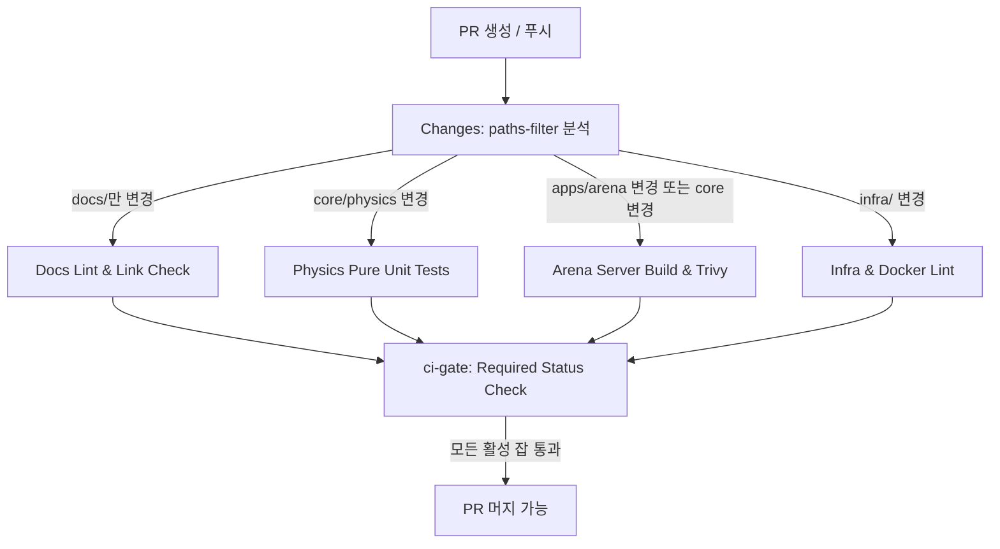

# Git Workflow & CI/CD Governance

## 1. 브랜치 전략 (Trunk-Based Development)

### 1.1 브랜치 구조
- `main`: 프로덕션 배포 기준 브랜치. 직접 커밋 및 강제 푸시(`push -f`) 절대 금지.
- 작업 브랜치: `main`에서 분기하며 수명은 최대 1~2일을 초과하지 않는다.
- 머지 방식: **Squash and Merge 전용** (선형 커밋 히스토리 강제).

### 1.2 브랜치 네이밍 규칙 (이슈 번호 배제)
- `feat/<work-name>`: 신규 기능 (예: `feat/display-ball-entity`)
- `fix/<work-name>`: 일반 결함 수정 (예: `fix/magnus-force-overflow`)
- `infra/<work-name>`: 인프라, Docker, 네트워크, CI/CD 변경 (예: `infra/docker-bridge-setup`)
- `docs/<work-name>`: 문서 전용 변경 (예: `docs/architecture-update`)
- `hotfix/<incident-name>`: 긴급 장애 대응 패치 (예: `hotfix/velocity-hmac-mismatch`)

### 1.3 커밋 메시지 컨벤션
- 형식: `<type>(<scope>): <한글 요약>` (scope는 권장 사항)
  - Type: `feat`, `fix`, `refactor`, `docs`, `chore`, `test`, `style`, `perf`, `ci`
  - Subject: 마침표 없는 명확한 한국어 요약
  - 예시: `feat(physics): 마그누스 효과 100Hz 서브스텝 연산 루프 구현`

---

## 2. 긴급 패치 (Hotfix) 거버넌스 및 기술 부채 방어

### 2.1 Hotfix 라이프사이클
1. 최신 `main` 브랜치에서 `hotfix/<incident-name>`으로 분기.
2. 최소 단위의 패치 코드 작성.
3. PR 생성 후 핫픽스 간이 파이프라인 통과 확인 즉시 Squash and Merge.
4. 패치 버전 태그 발행 (`vX.Y.Z+1`) 및 오케스트레이터를 통한 웜 풀 무중단(Drain & Rolling) 배포.

### 2.2 핫픽스 드리프트 방어책 (Anti-Drift Guard)
- **정적 분석 및 핵심 테스트 강제**: 긴급 상황이라도 Detekt 린트와 패치 대상 모듈의 단위 테스트는 바이패스할 수 없다.
- **사후 부채 추적**: 핫픽스로 임시 우회된 코드가 있을 경우, 머지 직후 `AGENTS.md`의 아키텍처 불변식 준수 여부를 재검증하는 정규 리팩토링 티켓/브랜치를 즉시 분기한다.

---

## 3. 모노레포 CI/CD 파이프라인 거버넌스

### 3.1 Aggregator Gate 패턴 (`ci-gate`)
GitHub Actions 기본 `paths` 필터 사용 시 Required Status Check가 `Pending` 상태로 영구 정지하는 문제를 방지하기 위해, 최종 종합 게이트 잡(`ci-gate`)을 단일 필수 체크로 등록한다.

### 3.2 전파 의존성 무효화 방어책 (Transitive Invalidation Defense)
경로 기반 필터의 상위 모듈 누락 위험을 방지하기 위해 다음 규칙을 파이프라인에 하드코딩한다:
- **의존성 체이닝**:
  - `core/physics` 변경 감지 시 -> `core/physics` 단위 테스트 + `apps/arena-server` 통합 빌드를 동시 트리거.
  - `core/stats` 변경 감지 시 -> `core/stats` 단위 테스트 + `apps/arena-server` 통합 빌드를 동시 트리거.
  - Gradle 설정(`build.gradle.kts`, `gradle.properties`) 변경 시 -> 전체 모듈 테스트 강제 트리거.
- **Gradle 증분 빌드 캐시(UP-TO-DATE)**:
  - `actions/cache`를 연동하여 소스 트리가 변경되지 않은 하위 태스크는 캐시 히트로 1초 내 통과하도록 보장.

### 3.3 Docs 초고속 바이패스 경로 (Fast-Path)
- **트리거**: 변경 파일 집합이 오직 `docs/**`, `*.md`, `.gitignore`에만 속할 때.
- **수행 작업**: Markdownlint 및 상대 경로 링크 유효성 검사만 10초 이내 수행.
- **효과**: 불필요한 JVM 기동, Gradle 의존성 다운로드, Docker 빌드를 전면 생략하여 CI 병목 차단.

---

## 4. GitHub 브랜치 보호 하드 가드 권장 설정

리포지토리 설정(`Settings -> Branches -> Add branch ruleset` 또는 `Branch protection rules`) 시 다음 항목을 필수로 활성화한다:

| 설정 항목 | 활성화 값 | 목적 |
|---|---|---|
| **Branch name pattern** | `main` | 기본 프로덕션 브랜치 보호 |
| **Require a pull request before merging** | Enabled | `main` 직접 커밋/푸시 원천 차단 |
| **Require approvals** | 0 (협업 시 1로 상향) | 1인 개발 시 자가 머지 허용 |
| **Dismiss stale pull request approvals** | Enabled | 신규 커밋 발생 시 기존 승인 무효화 |
| **Require status checks to pass** | Enabled (Strict) | 최신 `main`과 동기화 후 테스트 통과 필수 |
| **Status check: `ci-gate`** | Required | Aggregator Gate 최종 성공 필수 |
| **Require linear history** | Enabled | 머지 커밋 차단, 히스토리 단순화 |
| **Do not allow bypassing the above settings** | Enabled | 관리자 권한 우회 차단 |
